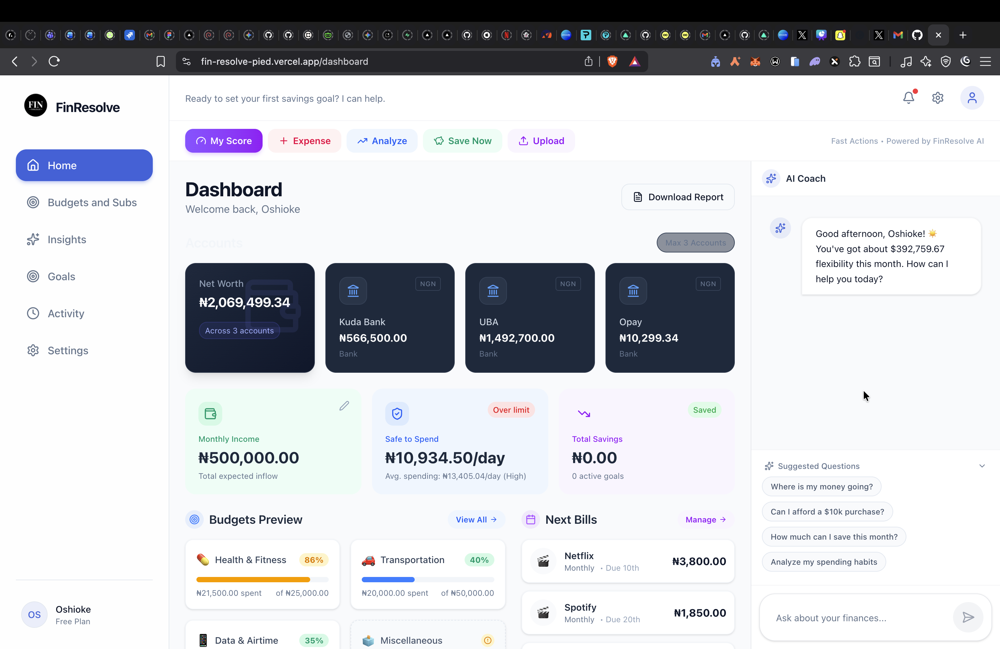
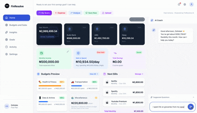
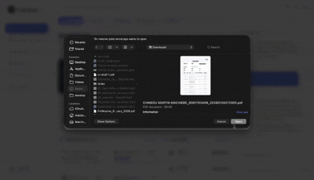
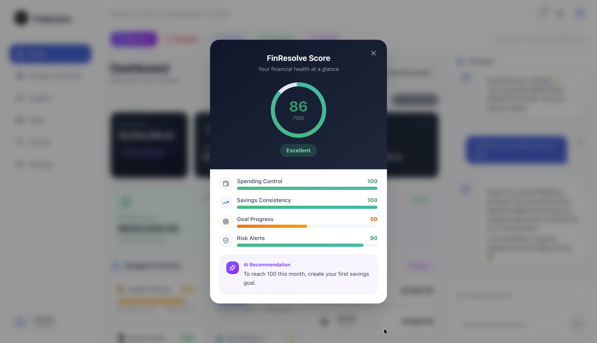
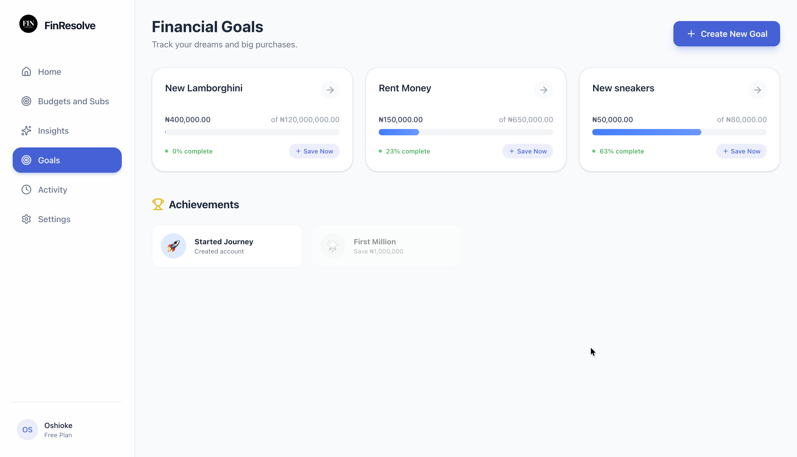

<p align="center">
  
</p>

<h1 align="center">FinResolve</h1>

<p align="center">
  <strong>The Private Banker in Your Pocket.</strong>
</p>

<p align="center">
  <em>Stop "managing" money. Start understanding it. FinResolve turns cryptic bank statements into a personalized financial roadmap using GPT-4o and advanced LLM observability.</em>
</p>

<p align="center">
  
  
  
  
  
  
</p>

---

## ✨ The Vision

FinResolve is a **chat-first AI financial partner** that makes managing money feel like talking to a knowledgeable friend. No rigid forms, no cryptic categories—just clear, actionable insights driven by your actual spending data.

<p align="center">
  
</p>

### 🚀 Key Innovations

- **Natural Language Interaction**: Talk to your money. "Can I afford that vacation?"
- **Ghost-Writer PDF Parser**: Drop a bank statement and let the AI extract 60+ transactions in seconds.
- **FinResolve Score™**: A real-time "Health Check" for your wealth.
- **LLM Observability**: Powered by **Opik** for 99.9% reliable AI responses.

---

## 🛠️ Features

### 1. Smart Transaction Engine

- **Voice-to-Data**: Log transactions in plain English: _"Spent 5k on diesel"_ or _"Paid 150 for electricity"_.
- **Multi-Currency Mastery**: Automatic parsing for USD, NGN, EUR, and 6 other major currencies.
- **Intelligent Shorthand**: Understands "5k", "2.5m", and custom shorthand based on your location.

<p align="center">
  
</p>

### 2. The PDF Power-Wash

- **One-Click Import**: Upload PDF/CSV statements.
- **Batch Processing**: AI cleans merchant names (e.g., "POS PAYMENT - CHICKEN REPUB" becomes "Chicken Republic").
- **Smart Categorization**: 23 categories handled with industrial-grade accuracy.

<p align="center">
  
</p>

### 3. Financial Coaching & Insights

- **FinResolve Score™**: A live 0-100 gauge of your financial health, visible on every page.
- **Proactive Nudges**: _"You've used 80% of your food budget with 10 days left."_
- **Weekly Insights**: Rule-based pattern detection to catch spending spikes before they hurt.

<p align="center">
  
</p>

### 4. Goals & Wealth Building

- **Interactive Setup**: Create goals for anything—from "Emergency Fund" to "New Laptop".
- **Intelligent Prioritization**: Set goals as High, Medium, or Low priority. The AI understands which ones to fund first.
- **Progress Tracking**: Dynamic progress bars and "Time-to-Completion" estimates based on your current savings rate.

<p align="center">
  
</p>

### 5. Budgeting & Subscription Control

- **Smart Limits**: Set monthly or weekly limits for any of the 23 spending categories.
- **Subscription Vault**: Track Netflix, Spotify, and bills in one place. AI automatically flags price hikes or double-billing.
- **"Safe to Spend"**: Live calculation of your disposable income after accounting for upcoming bills and goals.

### 6. The Multi-Account Hub

- **Universal Tracking**: Managed balances across **Bank Accounts**, **Mobile Money**, **Cash**, and **Crypto**.
- **Internal Transfers**: Log transfers between your accounts (e.g., _"Moved 20k from Cash to Bank"_) without affecting your net spending.

### 7. Mission-Critical Privacy

- **Privacy-First AI**: Your data is yours. We use advanced LLM observability (**Opik**) to ensure AI quality while maintaining strict data isolation.
- **No Manual Forms**: Most apps feel like homework. FinResolve feels like a conversation.

---

## 📊 Analytics & Reporting

**Downloadable PDF Reports**

- Generate professional monthly financial reports as downloadable PDFs
- Select any month/year to generate a report for
- Report includes:
  - **Executive Summary**: Total income, expenses, net savings, and savings rate
  - **Cash Flow Visualization**: Visual bar showing income vs. expenses
  - **Spending by Category**: Full breakdown table of where your money went
  - **Top Expenses**: Largest individual transactions for the month
  - **AI Insights**: GPT-4o analyzes your month and provides a personalized summary with recommendations
- Professional formatting with FinResolve branding

---

### Weekly Insights Dashboard

**Dedicated Analytics Page**

- KPI cards: total spent this week, daily average, top spending category
- Daily spending trend chart (last 7 days)
- Category breakdown pie chart
- AI coach commentary analyzing your patterns
- Quick-add expense button for on-the-spot logging

---

### Activity History

**Full Transaction Ledger**

- Complete history of all transactions with pagination
- Multi-filter system: by type (expense/income/transfer), by category, by search term
- Sorting options: newest, oldest, highest amount, lowest amount
- Shows date, merchant name, category, amount, and associated account for every entry

---

### Onboarding That Actually Works

A **4-step wizard** gets you up and running in under 2 minutes:

1. **Welcome** — Tell us your name
2. **Income & Currency** — Select your currency and set your monthly income
3. **Expenses** — Select your typical spending categories
4. **Goals** — Choose from common financial goals

**Supported Currencies:**
| Flag | Code | Currency | Symbol |
|------|------|----------|--------|
| 🇺🇸 | USD | US Dollar | $ |
| 🇪🇺 | EUR | Euro | € |
| 🇬🇧 | GBP | British Pound | £ |
| 🇳🇬 | NGN | Nigerian Naira | ₦ |
| 🇮🇳 | INR | Indian Rupee | ₹ |
| 🇰🇪 | KES | Kenyan Shilling | KSh |
| 🇿🇦 | ZAR | South African Rand | R |
| 🇨🇦 | CAD | Canadian Dollar | C$ |
| 🇦🇺 | AUD | Australian Dollar | A$ |

No overwhelming forms. No 50-field profiles. Just what we need to start helping you.

---

## Tech Stack

### Frontend

| Technology         | Purpose                         |
| ------------------ | ------------------------------- |
| **Next.js 16**     | React framework with App Router |
| **React 19**       | UI library with latest features |
| **TypeScript 5**   | Type-safe development           |
| **Tailwind CSS 4** | Utility-first styling           |
| **Framer Motion**  | Smooth animations               |
| **Recharts**       | Beautiful data visualizations   |
| **Lucide Icons**   | Modern icon system              |

### Backend & Database

| Technology             | Purpose                                |
| ---------------------- | -------------------------------------- |
| **Supabase**           | PostgreSQL database + Auth + Real-time |
| **Row-Level Security** | Database-level access control          |
| **Server Actions**     | Next.js server-side functions          |

### AI & Intelligence

| Technology          | Purpose                                                                                      |
| ------------------- | -------------------------------------------------------------------------------------------- |
| **OpenAI GPT-4o**   | Primary conversational AI for chat coaching, transaction categorization, and report insights |
| **Google Gemini**   | Secondary LLM used for general question answering during onboarding                          |
| **Opik (Comet ML)** | LLM observability platform — traces every AI call across the app (see details below)         |
| **Custom NLP**      | Currency shorthand & intent parsing                                                          |

### Document Processing & Reports

| Technology            | Purpose                                                 |
| --------------------- | ------------------------------------------------------- |
| **jsPDF + autoTable** | Client-side PDF report generation                       |
| **unpdf**             | **Serverless-optimized** text extraction for statements |

### Opik — What It Does

[Opik](https://www.comet.com/site/products/opik/) by Comet ML is the **LLM observability layer** for FinResolve. Every AI call in the app is traced through Opik so developers can monitor, debug, and optimize AI behavior in production.

**What Opik traces in FinResolve:**

| Traced Operation            | Trace Name          | What Gets Logged                                                 |
| --------------------------- | ------------------- | ---------------------------------------------------------------- |
| **AI Chat Responses**       | `financial-advice`  | Full context, response, latency, token usage, and model data.    |
| **Bank Statement Analysis** | `ai-categorization` | Categorization confidence, batch metrics, and merchant cleaning. |
| **Weekly Insights**         | `weekly-insight`    | Rule-based triggers and AI-generated pattern commentary.         |

**How it works:**

- Each AI operation creates a **trace** (the top-level unit) with input/output data and tags (e.g., `["openai", "financial-coach"]`)
- Within a trace, **spans** capture granular steps — for example, the `openai-generation` span inside a chat trace logs the exact messages sent to the API, the response, model, provider, and latency
- After each operation, the Opik buffer is flushed to send data to the Comet dashboard
- All traces are organized under the project name `FinResolve1` in the Opik workspace

**Why this matters:**

- **Debugging**: See exactly what the AI received and responded with for any user interaction
- **Performance**: Track latency per call to identify slow responses
- **Cost monitoring**: Token usage per request helps forecast and control API spend
- **Quality**: Review AI outputs in the Opik dashboard to catch bad responses or hallucinations

---

## Architecture

```
┌──────────────────────────────────────────────────────────────────────┐
│                          FRONTEND (Next.js)                          │
├──────────────────────────────────────────────────────────────────────┤
│  ┌──────────────┐  ┌──────────────┐  ┌────────────┐  ┌───────────┐  │
│  │  Dashboard   │  │   Chat AI    │  │ Onboarding │  │  Reports  │  │
│  │  - Pulse     │  │  - GPT-4o    │  │ - 4-Step   │  │ - Monthly │  │
│  │  - Charts    │  │  - Actions   │  │   Wizard   │  │   PDF     │  │
│  │  - Goals     │  │  - NLP Parse │  │ - Profile  │  │ - AI      │  │
│  │  - Budgets   │  │  - History   │  │   Setup    │  │   Insight │  │
│  └──────────────┘  └──────────────┘  └────────────┘  └───────────┘  │
│                              │                                       │
│  ┌───────────────────────────┴────────────────────────────────────┐  │
│  │               Context Providers (Auth + Financial)             │  │
│  └────────────────────────────┬───────────────────────────────────┘  │
└───────────────────────────────┼──────────────────────────────────────┘
                                │
              ┌─────────────────┴──────────────────┐
              │          Server Actions            │
              │  ai.ts, ai-categorize.ts,          │
              │  parse-pdf.ts, insights.ts,        │
              │  report.ts                         │
              └─────────────────┬──────────────────┘
                                │
     ┌──────────────┬───────────┼───────────┬──────────────┐
     │              │           │           │              │
┌────┴─────┐ ┌──────┴────┐ ┌───┴────┐ ┌────┴─────┐ ┌──────┴─────┐
│ Supabase │ │  OpenAI   │ │ Gemini │ │   Opik   │ │   jsPDF    │
│ Database │ │  GPT-4o   │ │  LLM   │ │ Tracing  │ │   Reports  │
│ + Auth   │ │ Chat/Cat. │ │Onboard.│ │ Observ.  │ │   PDF Gen  │
└──────────┘ └───────────┘ └────────┘ └──────────┘ └────────────┘
```

---

## Project Structure

```
frontend/
├── src/
│   ├── app/                        # Next.js App Router
│   │   ├── (app)/                  # Protected routes
│   │   │   ├── dashboard/          # Main dashboard (70/30 split)
│   │   │   ├── activity/           # Transaction history & filters
│   │   │   ├── goals/              # Savings goals management
│   │   │   ├── budgets/            # Budgets & subscriptions
│   │   │   ├── insights/           # Weekly analytics dashboard
│   │   │   └── settings/           # Profile, password, account deletion
│   │   ├── (auth)/                 # Login & signup
│   │   ├── (marketing)/            # Landing page
│   │   └── (onboarding)/           # First-time user flow
│   │
│   ├── components/                 # React components
│   │   ├── chat/                   # AI chat interface (desktop + mobile)
│   │   ├── dashboard/              # Dashboard widgets & score modal
│   │   ├── modals/                 # Statement upload, add transaction, add goal
│   │   ├── reports/                # Monthly PDF report modal
│   │   ├── coach/                  # Weekly AI insight widget
│   │   ├── insights/               # Analytics charts
│   │   ├── onboarding/             # Wizard steps
│   │   ├── layout/                 # Sidebar navigation
│   │   └── ui/                     # Reusable primitives
│   │
│   ├── contexts/                   # React Context providers
│   │   ├── AuthContext.tsx         # Authentication state
│   │   └── FinancialContext.tsx    # Financial data state
│   │
│   ├── actions/                    # Server-side actions
│   │   ├── ai.ts                   # AI chat response generation (Opik-traced)
│   │   ├── ai-categorize.ts        # Batch transaction categorization (Opik-traced)
│   │   ├── parse-pdf.ts            # PDF bank statement extraction
│   │   ├── insights.ts             # Weekly analytics computation
│   │   ├── report.ts               # AI insights for monthly reports
│   │   ├── onboarding.ts           # Onboarding Q&A (Gemini)
│   │   └── account.ts              # Password change & account deletion
│   │
│   └── lib/                        # Utilities
│       ├── coach/
│       │   └── generateInsight.ts  # Rule-based weekly insights (Opik-traced)
│       ├── types.ts                # All TypeScript types & constants
│       ├── scoreCalculation.ts     # FinResolve Score algorithm
│       ├── report-generator.ts     # PDF generation (jsPDF + autoTable)
│       ├── parseInput.ts           # Currency formatting & number parsing
│       ├── parseStatement.ts       # CSV bank statement parser
│       ├── supabase.ts             # Supabase database client
│       ├── openaiClient.ts         # OpenAI API client
│       ├── geminiClient.ts         # Google Gemini API client
│       └── opikClient.ts           # Opik observability client
│
├── supabase-schema.sql             # Database schema
└── package.json                    # Dependencies
```

---

## Database Schema

```sql
-- Core tables (simplified)

profiles           -- User financial profile
├── id             -- UUID (FK to auth.users)
├── name           -- Display name
├── currency       -- User's preferred currency (USD, EUR, GBP, NGN, etc.)
├── monthly_income -- Income in user's selected currency
├── has_completed_onboarding
└── data_completeness_score

spending_entries   -- Individual transactions
├── id
├── user_id
├── amount
├── category       -- food, transport, utilities, etc.
├── type           -- expense, income, transfer
├── description
├── source         -- manual, csv, ai
└── confidence     -- high, medium, low

savings_goals      -- Financial goals
├── id
├── user_id
├── name
├── target_amount
├── current_amount
├── deadline
└── priority       -- high, medium, low

accounts           -- Bank/mobile money accounts
├── id
├── user_id
├── name
├── type           -- bank, mobile_money, cash, crypto
└── balance

budgets            -- Spending limits
├── id
├── user_id
├── category
├── limit_amount
└── period         -- monthly, weekly, yearly

recurring_items    -- Subscriptions & bills
├── id
├── user_id
├── name
├── amount
├── category
├── frequency      -- daily, weekly, monthly, yearly
└── next_due_date
```

---

## Getting Started

### Prerequisites

- Node.js 18+
- pnpm (recommended) or npm
- Supabase account (free tier works)
- OpenAI API key

### Installation

1. **Clone the repository**

   ```bash
   git clone https://github.com/yourusername/finresolve.git
   cd finresolve/frontend
   ```

2. **Install dependencies**

   ```bash
   pnpm install
   ```

3. **Set up environment variables**

   ```bash
   cp .env.example .env
   ```

   Fill in your credentials:

   ```env
   # Supabase
   NEXT_PUBLIC_SUPABASE_URL=your_supabase_url
   NEXT_PUBLIC_SUPABASE_ANON_KEY=your_supabase_anon_key

   # AI Providers
   OPENAI_API_KEY=your_openai_key
   GEMINI_API_KEY=your_gemini_key          # Optional — used for onboarding Q&A

   # Opik Observability (Optional — for LLM tracing)
   OPIK_API_KEY=your_opik_api_key
   OPIK_WORKSPACE=your_workspace_name
   OPIK_PROJECT_NAME=FinResolve1           # Defaults to "FinResolve1"
   ```

4. **Set up Supabase database**
   - Create a new Supabase project
   - Run the SQL from `supabase-schema.sql` in the SQL editor
   - Apply RLS policies from `supabase-auth-policies.sql`

5. **Start the development server**

   ```bash
   pnpm dev
   ```

6. **Open your browser**
   ```
   http://localhost:3000
   ```

---

## Usage

### Logging Expenses via Chat

Simply tell FinResolve what you spent:

```
You: I spent 5k on groceries today
AI:  Got it! I've logged ₦5,000 to Food. Your food budget is now at 65%.

You: Paid electricity bill - exactly ₦15,000
AI:  Logged ₦15,000 to Utilities. You have ₦35,000 left in this month's utilities budget.

You: Transferred 50k to savings
AI:  Nice! Logged ₦50,000 transfer to Savings. You're now 45% toward your Emergency Fund goal!
```

### Asking Questions

```
You: Can I afford a ₦200k vacation next month?
AI:  Based on your current savings rate and expenses, you'd need to save an additional
     ₦85,000 this month. That's possible if you cut dining out by 40%. Want me to
     create a temporary budget to help you track this?

You: How am I doing this month?
AI:  You're doing well! Here's your snapshot:
     • Spent ₦180,000 of ₦350,000 income (51%)
     • On track for Emergency Fund goal (ahead by 2 days!)
     • 3 categories under budget, 1 slightly over (Transport at 105%)
     Your FinResolve Score: 74 (Strong)
```

### Dashboard Overview

The dashboard provides a 70/30 split layout:

- **Left (70%)**: Financial data, charts, goals, budgets
- **Right (30%)**: AI chat panel

Key widgets:

- **Financial Pulse**: Income, spending, net worth at a glance
- **Spending Chart**: Category breakdown visualization
- **Trend Chart**: Daily/weekly spending patterns
- **Budget Progress**: Visual progress bars per category
- **Goal Tracker**: Progress toward savings goals
- **Recent Activity**: Latest transactions

---

## Spending Categories

FinResolve supports 23 spending categories:

| Category       | Emoji | Description                         |
| -------------- | ----- | ----------------------------------- |
| Food           | 🍔    | Groceries, restaurants, delivery    |
| Transport      | 🚗    | Fuel, Uber, public transit          |
| Utilities      | 💡    | Electricity, water, internet        |
| Housing        | 🏠    | Rent, mortgage, repairs             |
| Entertainment  | 🎬    | Movies, streaming, events           |
| Shopping       | 🛍️    | Clothing, electronics, general      |
| Health         | 💊    | Medical, gym, wellness              |
| Education      | 📚    | Courses, books, tuition             |
| Savings        | 💰    | Transfers to savings                |
| Family         | 👨‍👩‍👧    | Family support, gifts to family     |
| Debt           | 💳    | Loan payments, credit cards         |
| Personal Care  | 💅    | Grooming, self-care                 |
| Investment     | 📈    | Stocks, crypto, business            |
| Tax            | 🏛️    | Tax payments                        |
| Salary         | 💵    | Income from employment              |
| Business       | 💼    | Business expenses                   |
| Gift           | 🎁    | Gifts to others                     |
| Data & Airtime | 📱    | Airtime, data bundles               |
| Travel         | ✈️    | Flights, hotels, Airbnb             |
| Insurance      | 🛡️    | Life, health, car, property         |
| Subscriptions  | 🔄    | Spotify, Netflix, app subscriptions |
| Charity        | 🤝    | Donations, tithing, non-profits     |
| Other          | 📦    | Miscellaneous                       |

---

## API Reference

### Server Actions

#### `generateAIResponse(query, profile, history)`

Generates an AI chat response with full financial context. Traced via Opik.

```typescript
const response = await generateAIResponse(
  "I spent 5k on food",
  userProfile,
  chatHistory,
);
// Returns: { content: string, confidence: string, actions: AIAction[] }
// Actions: LOG_EXPENSE, LOG_INCOME, LOG_TRANSFER, UPDATE_GOAL, CREATE_GOAL, CREATE_BUDGET
```

#### `categorizeTransactionsAI(transactions)`

Batch-categorizes raw bank transactions using GPT-4o. Traced via Opik.

```typescript
const categorized = await categorizeTransactionsAI([
  { id: "1", description: "POS PAYMENT - CHICKEN REPUB LAGOS", amount: 5000 },
]);
// Returns: { id, merchantName: 'Chicken Republic', category: 'food', confidence: 'high' }[]
```

#### `generateWeeklyInsight(profile)`

Generates rule-based weekly financial insights. Traced via Opik.

```typescript
const insight = await generateWeeklyInsight(userProfile);
// Returns: { type: 'spending_spike' | 'saving_opportunity' | 'routine_check', message, confidence }
```

#### `generateReportInsight(profile, month)`

Generates AI-powered insights for monthly PDF reports.

#### `parsePDFStatement(file)`

Extracts transactions from a PDF bank statement using AI-powered text recognition.

### Context Hooks

#### `useAuth()`

```typescript
const { user, profile, signIn, signUp, signOut, loading } = useAuth();
```

#### `useFinancial()`

```typescript
const {
  profile,
  addSpending,
  updateGoal,
  addAccount,
  updateBudget,
  calculateScore,
} = useFinancial();
```

---

## Contributing

We welcome contributions! Here's how:

1. Fork the repository
2. Create a feature branch (`git checkout -b feature/amazing-feature`)
3. Commit your changes (`git commit -m 'Add amazing feature'`)
4. Push to the branch (`git push origin feature/amazing-feature`)
5. Open a Pull Request

### Development Guidelines

- Use TypeScript for all new code
- Follow existing code patterns and conventions
- Write meaningful commit messages
- Test your changes thoroughly
- Update documentation as needed

---

## Roadmaps

### Completed

- [x] **Multi-currency support** (USD, EUR, GBP, NGN, INR, KES, ZAR, CAD, AUD)
- [x] **PDF bank statement parsing** with AI-powered categorization
- [x] **Monthly PDF report generation** with AI insights
- [x] **LLM observability** via Opik (Comet ML) tracing
- [x] **Weekly insights dashboard** with charts and AI coach commentary

### Near Term

- [ ] Email verification flow
- [ ] Password reset functionality
- [ ] Push notifications for budget alerts

### Medium Term

- [ ] Plaid integration for automatic bank sync
- [ ] Shared budgets (couples/families)
- [ ] Receipt scanning with OCR

### Long Term

- [ ] Investment tracking & portfolio analysis
- [ ] Tax optimization suggestions
- [ ] Financial planning simulations
- [ ] API for third-party integrations

---

## License

This project is licensed under the MIT License. See `LICENSE` for details.

---

## 🤝 Acknowledgments

- **OpenAI** — For GPT-4o, the best conversational mind on the planet.
- **Comet ML** — For Opik, the only way to build production-grade AI safely.
- **Supabase** — For making the backend "just work."
- **Next.js & Vercel** — For the speed of development and deployment.

---

<p align="center">
  <strong>Built with purpose. Designed for clarity. Powered by AI.</strong>
</p>

<p align="center">
  <em>FinResolve — Because your money deserves better.</em>
</p>

---
